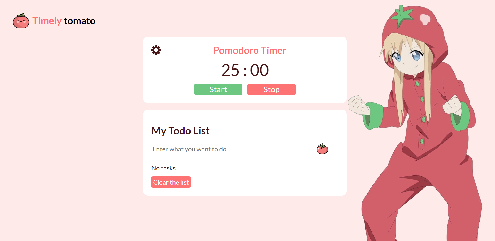

# pomodoro-todolist

To-do list and time tracking app

##### 1️⃣ Start
When clicked, the timer starts. When the study time is over, the alarm will automatically sound.

##### 2️⃣ Stop 
Сlick to stop the timer at the current time. When you click on start, the timer will start again.

##### 3️⃣ Settings
Click the ⚙️ button to open the settings window and change the timer to the saved time.

##### 4️⃣ Add Task 
When you click the 🍅 button or enter, the entered text from the input will be displayed in the task list.

##### 5️⃣ Delete Task
Click the ❌ button to remove the task from the list.

##### 6️⃣ Clear the list
Сlick to clear the list to delete all tasks.

## Getting started

Host the parent directory on the webserver

## Technologies

<code></code>
<code></code>
<code></code>

## Demo

[Pomodoro-todolist]

[Pomodoro-todolist]: <https://pomodoro-todolist.vercel.app/>
